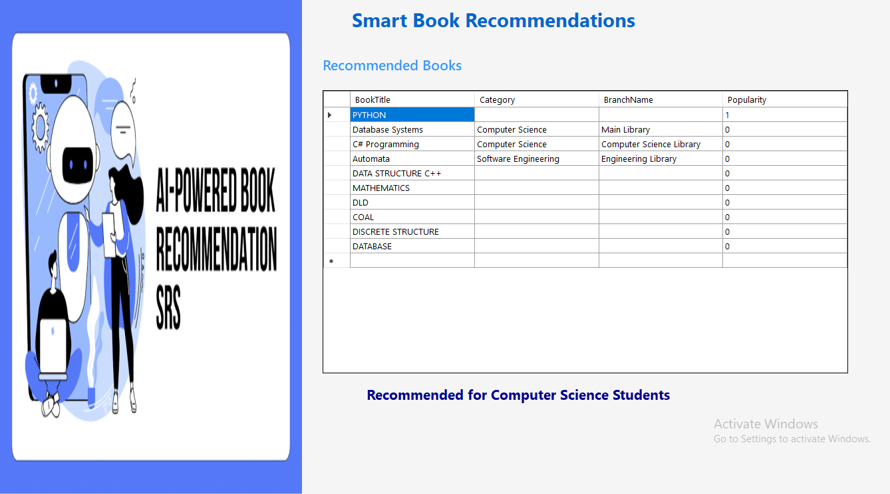
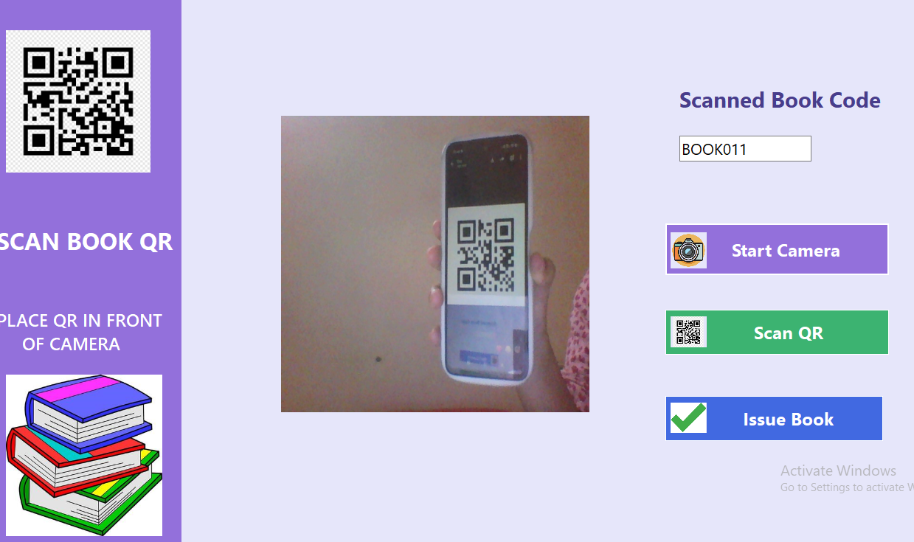

# 📚 QR-Based Digital Library System

A comprehensive Digital Library Management System developed to automate library operations using QR Code technology.

The system allows librarians and administrators to manage books, students, book issuing, returns, overdue records, fines, and borrowing history efficiently. QR codes are used to simplify and automate book circulation processes.

---

## 📌 Project Overview

The QR-Based Digital Library System is designed to digitize and automate traditional library management processes.

The system enables users to manage book circulation through QR Code scanning while maintaining digital records of issued books, returned books, overdue books, fines, and student borrowing history.

The project provides role-based access and administrative features to help librarians efficiently manage library operations.

---

## 🚀 Features

### 📖 Book Management
- Add and manage books
- Track book availability
- Maintain book records digitally

### 📱 QR Code-Based Book Issuing
- Scan QR codes to identify books
- Issue books to students
- Maintain digital issue records
- Apply borrowing limits

### 🔄 QR Code-Based Book Returns
- Scan QR codes to return books
- Automatically update book availability
- Record return dates digitally

### ⏰ Overdue Book Detection
- Identify overdue books
- Display overdue warnings
- Track students with overdue books

### 💰 Automatic Fine Calculation
- Automatically calculate fines for overdue books
- Maintain fine records
- Track fine payments

### 👨‍🎓 Student Management
- Manage student information
- Track borrowing history
- View currently issued books

### 🔐 Role-Based Access Control
- Separate access for administrators and users
- Secure management of library operations

### 📊 Dashboard & Analytics
- View total issued books
- Monitor overdue books
- Track active borrowers
- View fine reports
- Identify most borrowed books
- Monitor defaulters

### 🤖 Advanced Features
- AI-based book recommendations
- Activity logging
- Digital borrowing history
- Enhanced security features

---

## 🛠️ Technologies Used

| Technology | Purpose |
|------------|---------|
| C# | Core programming language |
| .NET Framework 4.8 | Application framework |
| Windows Forms | Desktop application user interface |
| MySQL | Database management |
| MySQL Connector | Database connectivity |
| ZXing | QR Code generation and scanning |
| Guna UI | Modern user interface components |
| Git | Version control |
| GitHub | Project hosting and collaboration |

---

## 📸 Project Screenshots

Screenshots of the application are available below.

### 🔐 Login Page


### 📊 Dashboard


### 📚 Book Management



### 📱 QR Code Scanner



---

## 📂 Project Structure

```text
QR-Based-Digital-Library-System
│
├── QRLibrarySystem
│   ├── Forms
│   ├── DBConnection.cs
│   ├── Program.cs
│   └── Other Source Files
│
├── Screenshots
│
├── packages
│
├── QRLibrarySystem.sln
│
├── .gitignore
│
└── README.md